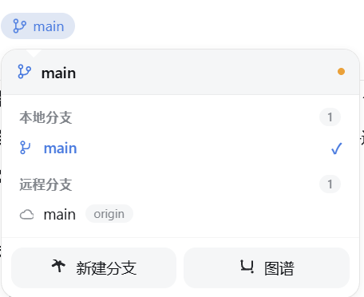
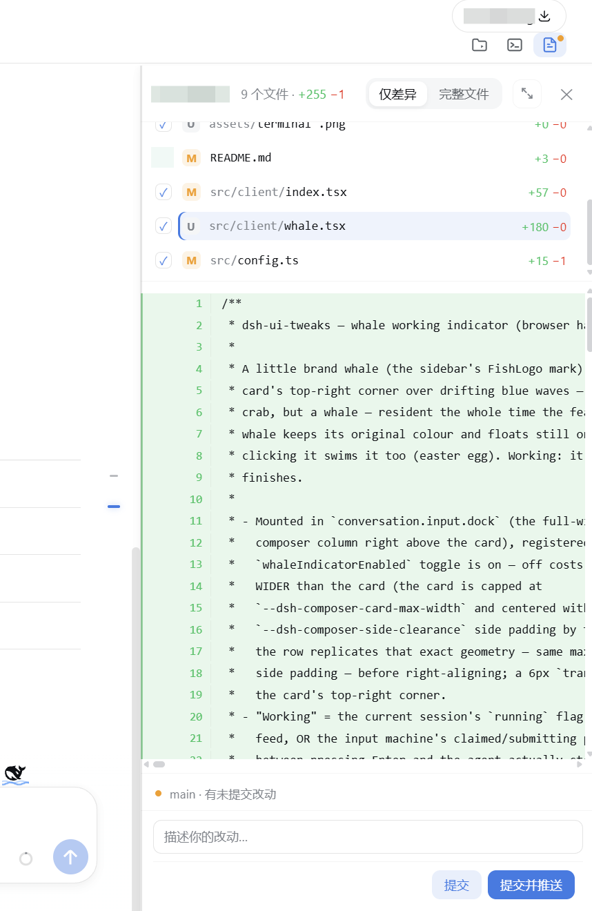
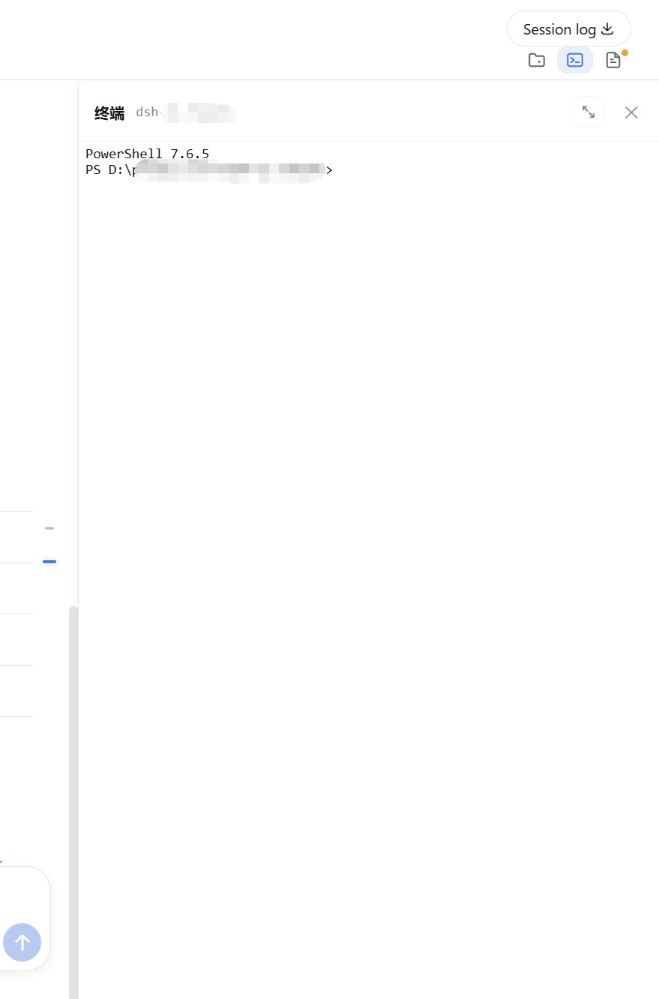
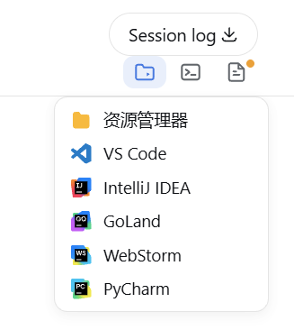
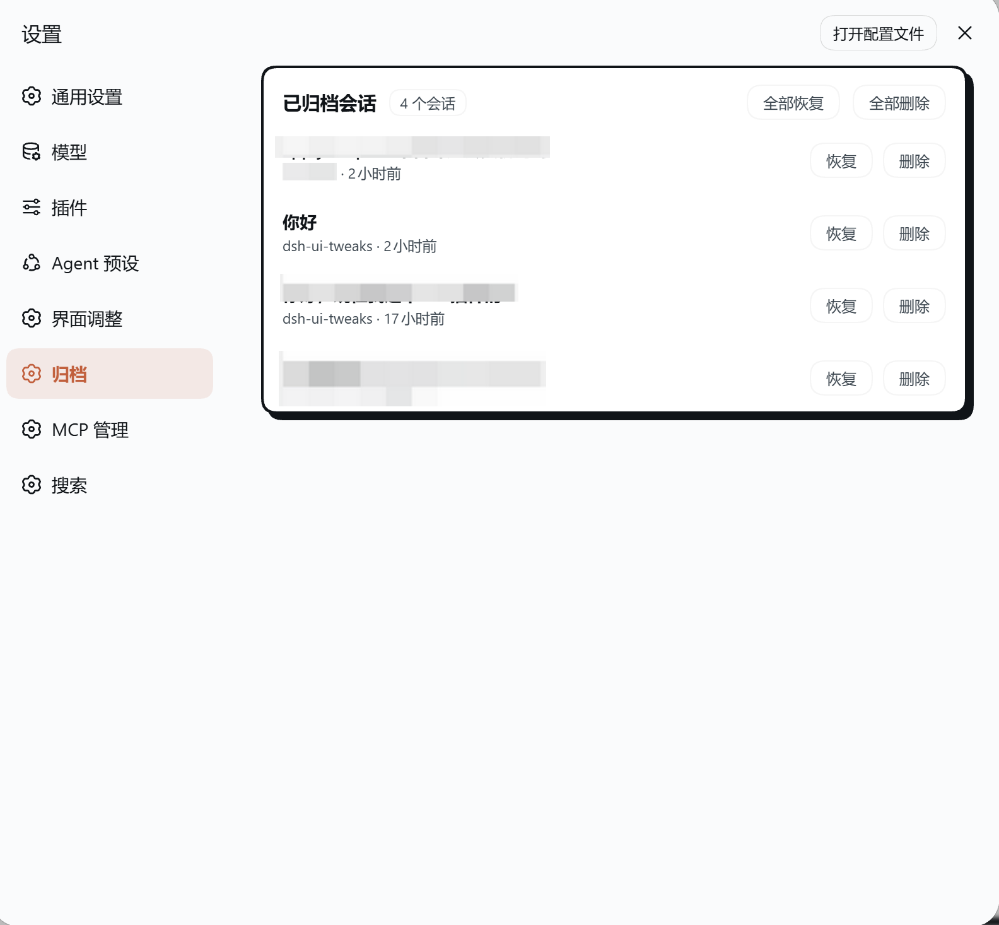
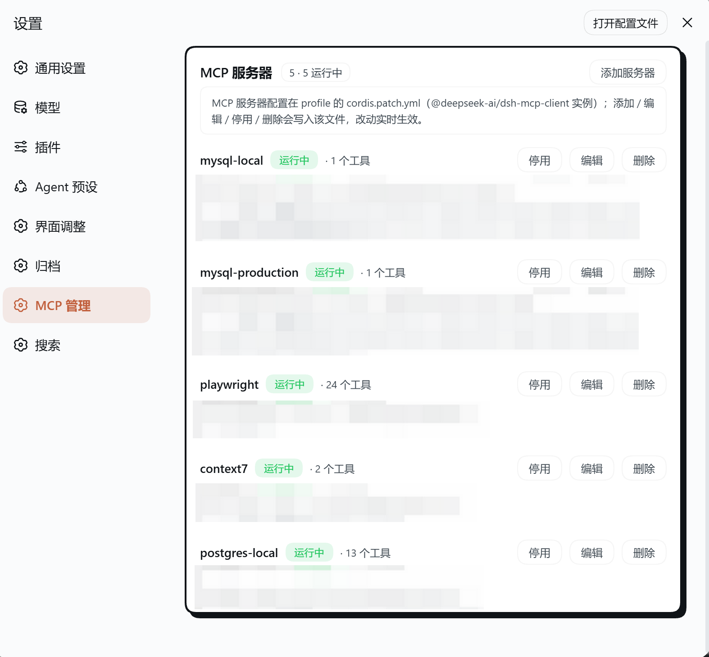

# dsh-ui-tweaks

A [DeepSeek Harness](https://deepseek-harness.github.io/deepseek-harness/) (DSH) web plugin that live-tunes the conversation UI from the Settings panel.

## Preview

| | |
|---|---|
|  |  |
| **Conversation timeline**: right-side rail — hover to preview messages, click to jump, scroll-highlighting, auto-dodges a right sidebar | **Table style**: the Claude Desktop look (light-gray rounded cards) |
|  |  |
| **Dialog width**: message column, composer and stats line widen together | **Settings panel**: font & code size / line spacing / table style / dialog width / timeline / GitBar / whale indicator toggles |
|  |  |
| **GitBar**: git pills inside the composer tool row (branch after the access-mode control, diff before the model select) — branch management, per-file diff, and commit & push from the diff panel | **Branch panel**: pops up from the branch pill — local / remote branch lists, click to switch, delete & push to remote, new-branch field at the bottom |
|  |  |
| **Diff panel**: file list + per-file diff (changed hunks only by default) with a commit area (commit / commit & push) at the bottom; drag to resize | **Terminal panel**: a real PTY terminal (xterm.js over WebSocket) — full interactivity, drag to resize, one-click half-screen |
|  | |
| **Open project**: the session-header icon menu — open the current project in Explorer / VS Code / IDEA / GoLand / WebStorm / PyCharm; the neighbouring terminal & diff icons toggle their panels | |
|  |  |
| **Archive manager**: an Archive page in the Settings dialog listing archived sessions (title / workspace / relative time) with Restore and Delete actions | **MCP manager**: an MCP page in the Settings dialog listing configured MCP servers with live status and full management (Add / Edit / Enable / Disable / Delete / Restart) |

## Features

- **Message font size (px)** — type any value (10–32); applies to message text, headings, tables and code. The **code font size** can be set separately (absolute 8–32px, default 13; inline code follows proportionally) — the legacy percentage (`codeFontScale`) stays compatible and is overridden once a px value is set.
- **Table style** — choose `Default` or the **Claude Desktop** look (light-gray rounded cell cards with small gaps, no borders; cells share the inline-code background; header not bold).
- **Dialog width (px)** — type any value (600–1600); the message column, the composer input and the stats line below it widen together.
- **Conversation timeline (toggleable, off by default)** — a thin navigation rail at the right of the message area: one indicator line per user message, hover to expand a preview panel, scroll-highlighting of the current position, click to smooth-scroll to that message (loading older history on demand). Works in **light and dark mode**, and **always hugs the message area's right edge** — even with a right sidebar installed and expanded (e.g. dsh-better-sidebar), the rail dodges it instead of overlapping. Auto-hidden while a session has fewer than two user messages.
- **GitBar (toggleable, off by default)** — when the session's working directory is a git repository, two compact pills render **inside the composer's tool row** (styled like the native access-mode / model-select controls, so the input area no longer carries a separate row above the card):
  - **Branch pill** — right after the access-mode control; shows the current branch and opens an upward branch panel (local / remote lists, `git switch` on click, new-branch field).
  - **Diff pill** — right before the model select; shows `+N −M · K files` and opens the right slide-over diff panel (changed-file list + per-file diff, resizable, commit band kept at its foot for 提交 / 提交并推送). The standalone commit pill is gone — commit now happens from the diff panel.
  - **Squeeze-aware**: the composer tool row is an inline-size container, so when it tightens (e.g. the stretched diff panel pushes the column), the pills degrade like the native chrome — first hiding the "· K files" meta, then collapsing to **icon-only** — never overlapping the access / model controls.
  - **Header utilities** — beside "Session log", an icon group: **Open project** (a menu launching Explorer / VS Code / IDEA / GoLand / WebStorm / PyCharm at the session cwd), a **real PTY terminal** panel (xterm.js over WebSocket, drag to resize, one-click half-screen) and the **diff** panel toggle; the diff icon carries the uncommitted-changes dot.
- **Archive manager (toggleable, off by default)** — an **Archive** page in the Settings dialog listing archived sessions (title / workspace / relative time) with per-row **Restore** and **Delete** actions plus batch **Restore all** / **Delete all** buttons.
  - **Restore** removes a session from the archive set (its log and workspace slot are kept, so the conversation returns to the normal sidebar list).
  - **Delete** PERMANENTLY deletes the session — the server removes its JSONL log from disk, detaches it from workspace accounting and the archive set, and clears its projection cache (irreversible). Only genuinely **running** sessions are refused; opened-but-idle sessions are also removed from the in-memory store, so the row disappears live.
  - The list refreshes live via the `host/archived-sessions-changed` event and a session-list re-pull, with no page reload.
- **MCP manager (toggleable, off by default)** — an **MCP** page in the Settings dialog listing every configured MCP server (`@deepseek-ai/dsh-mcp-client` loader entries) with its live status, command/url, env vars and registered tools, plus full management: **Add / Edit** (a structured form — instance id, name, stdio or HTTP type, timeout ms, command, args, env — OR raw YAML, both validated), **Enable / Disable / Delete**, and **Restart** (runtime-only). Changes persist to the profile's `cordis.patch.yml` and DSH's built-in patch watcher hot-reloads just that server.
- **`/init` slash command (toggleable, off by default)** — type `/init` in the composer (the slash menu shows "Analyze this project and generate an AGENTS.md"), pick a prompt language from the popup (**Chinese / English**), and a complete AGENTS.md bootstrap prompt is submitted into the current session: the agent explores the project on its own (README, manifests, build scripts, key directories), then writes or improves a root `AGENTS.md` addressed to future AI coding agents (overview, common commands, conventions, directory guide, gotchas; existing files are improved in place). Pure client-side contribution; enable it in the UI Tweaks settings section.
- **Whale indicator (toggleable, off by default)** — the brand whale perched on the composer card's **top-right corner** over drifting blue waves (the Claude Desktop crab spot). It stays in its original colour the whole time: idle it floats still (hover or click it to make it swim — an easter egg); while the model works it swims (bob + sway) until the turn finishes. Working state = the session's `running` flag plus the input machine's claimed/submitting phases, so the swim starts the moment you press Enter. Pure CSS animation on DSH theme tokens; honors `prefers-reduced-motion`.

All changes apply **live** — no reload needed. The same values can be hand-edited in the settings document:

```yaml
ui-tweaks:
  fontSize: 16
  tableStyle: claude
  dialogWidth: 880
  timelineEnabled: true   # defaults to false (off); set true to enable
  gitBarEnabled: true     # defaults to false (off); set true to enable GitBar
  archiveManagerEnabled: true   # defaults to false (off); set true to show the Archive page
  initCommandEnabled: true      # defaults to false (off); set true to register the /init slash command
  whaleIndicatorEnabled: true   # defaults to false (off); set true to enable the whale indicator
```

Settings entry: **Settings → UI Tweaks**.

## Install

```bash
# from npm (recommended, prebuilt)
npx -y @deepseek-ai/dsh plugin --profile web add dsh-ui-tweaks

# from GitHub (source; runs the self-contained prepare build)
npx -y @deepseek-ai/dsh plugin --profile web add github:wlj521/dsh-ui-tweaks
```

For GitHub installs, pnpm may ask you to approve the package's build script —
add the exact key it prints to the profile's `pnpm-workspace.yaml`:

```yaml
allowBuilds:
  dsh-ui-tweaks: true
```

…then run `add` again. Restart DSH web once after installing (bundle plugins
are scanned at process start).

> If pnpm reports symlink/hoist errors, set `nodeLinker: hoisted` in the
> profile's `pnpm-workspace.yaml`.

## Development

```bash
pnpm install
pnpm build          # tsc (server) + tsc (client) + bundle lib/client.js
pnpm typecheck
```

Load against a running DSH with an overlay, or install as a bundle:

```bash
npx -y @deepseek-ai/dsh web --patch ./cordis.patch.yml   # dev overlay
npx -y @deepseek-ai/dsh plugin --profile web add .        # bundle install from this checkout
```

## How it works

- **Server** (`src/index.ts`) registers the `ui-tweaks` settings namespace and
  mounts a same-origin route (`/_dsh/ui-tweaks/settings`) — the Web settings
  RPC only exposes a fixed allowlist of namespaces since rc.6, so a custom route
  is how a plugin owns a configuration page. `src/timeline.ts` also registers
  the `dshChatTimeline` session projection that durably enumerates user
  messages.
- **Browser** (`src/client/index.tsx`) reads/writes that route, renders the
  Settings section, and applies the values live via a runtime `<style>` element
  that overrides stable DSH anchors (`[data-chat-flow]`,
  `[data-composer-card]`, `body` markdown font tokens, markdown tables inside
  `[data-slot="conversation.chat.node"]`).
- **Timeline** (`src/client/timeline.tsx`) mounts in the
  `conversation.input.dock` slot and portals to `body`. Data sources, fastest
  first: session projection → loaded chat nodes → background `loadOlder`. Its
  position is anchored by measuring the right edge and vertical center of
  `[data-conversation-scroll]` (the message area), so it follows both the DSH
  column grid and any right-sidebar layout push (`#root` margin-right);
  colors ride DSH theme tokens (`--dsw-alias-*`) for correct light/dark
  rendering.

## License

MIT
