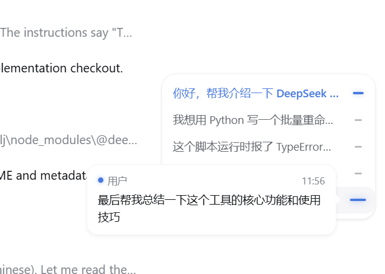
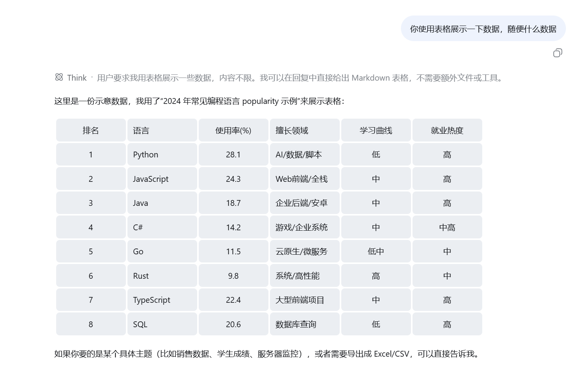
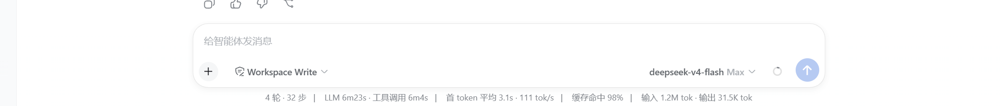
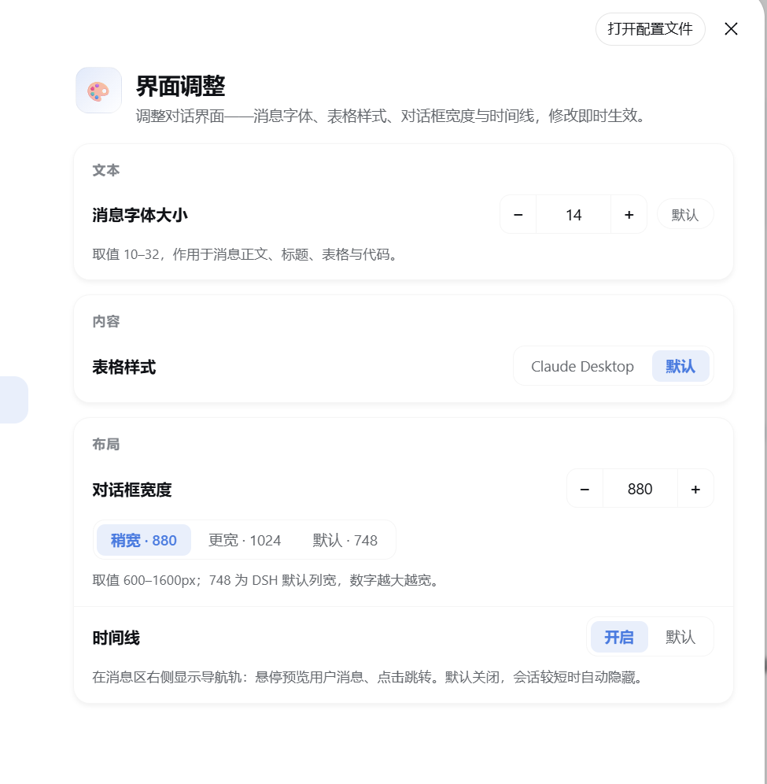

# dsh-ui-tweaks

[DeepSeek Harness](https://deepseek-harness.github.io/deepseek-harness/)（DSH）Web UI 插件：在设置面板中实时调整对话界面——字体大小、表格样式、对话框宽度，以及可开关的对话时间线。

## 预览

| | |
|---|---|
|  |  |
| **对话时间线**：右侧竖轨，悬停展开消息预览、点击跳转、随滚动高亮当前位置，自动避让右侧边栏 | **表格样式**：Claude Desktop 浅灰圆角卡片风格 |
|  |  |
| **对话框宽度**：消息列、输入框、统计栏同步变宽 | **设置面板**：字体大小 / 表格样式 / 对话框宽度 / 时间线 |

## 功能

- **消息字体大小（px）**：直接输入数字（10–32），作用于消息正文、标题、表格与代码。
- **表格样式**：可选 `默认` 或 **Claude Desktop** 风格（浅灰圆角单元格卡片、单元格间有间隙、无边框、单元格与行内代码同底色、表头不加粗）。
- **对话框宽度（px）**：直接输入数字（600–1600）；消息列、输入框、输入框下方的统计栏（轮数/步数/耗时/tok/s）**三者同步变宽**。
- **对话时间线（可开关，默认关闭）**：在消息区右侧显示细竖导航轨——每条用户消息一根指示线，悬停展开面板预览消息、随滚动高亮当前位置、点击平滑跳转到对应消息（自动加载更早历史）。**浅色/深色模式都正常显示**，且**始终贴在消息区右侧**：即使安装了右侧边栏（如 dsh-better-sidebar）并展开，时间线也会自动避让、不会与侧边栏重叠。会话中用户消息少于 2 条时自动隐藏。

所有修改**即时生效**，无需刷新。同一份配置也可以直接在设置文档里手改：

```yaml
ui-tweaks:
  fontSize: 16
  tableStyle: claude
  dialogWidth: 880
  timelineEnabled: true   # 默认 false（关闭），设为 true 开启
```

设置入口：**设置 → 界面调整**。

## 安装

```bash
# 方式一：从 npm 安装（推荐，预构建产物，一条命令装好）
npx -y @deepseek-ai/dsh plugin --profile web add dsh-ui-tweaks

# 方式二：从 GitHub 仓库安装（源码，会运行自包含的 prepare 构建）
npx -y @deepseek-ai/dsh plugin --profile web add github:wlj521/dsh-ui-tweaks
```

从 GitHub 安装时，pnpm 可能要求批准该包的构建脚本——把提示的包键加进该 profile 的 `pnpm-workspace.yaml`：

```yaml
allowBuilds:
  dsh-ui-tweaks: true
```

然后重新执行 `add`。安装完成后**重启一次 `dsh web`**（bundle 插件在进程启动时扫描）。

> 若 pnpm 报符号链接/hoist 相关错误，可在 profile 的 `pnpm-workspace.yaml` 中设置 `nodeLinker: hoisted`。

## 开发

```bash
pnpm install
pnpm build          # tsc（服务端）+ tsc（客户端）+ 打包 lib/client.js
pnpm typecheck
```

本地加载（覆盖层）或作为 bundle 安装：

```bash
npx -y @deepseek-ai/dsh web --patch ./cordis.patch.yml   # 开发覆盖层
npx -y @deepseek-ai/dsh plugin --profile web add .        # 从本目录作为 bundle 安装
```

## 工作原理

- **服务端**（`src/index.ts`）：注册 `ui-tweaks` 设置命名空间，并挂载同源路由 `/_dsh/ui-tweaks/settings`——rc.6 的 Web 设置 RPC 只暴露固定白名单命名空间，因此自定义路由是插件拥有配置页的方式。另在 `src/timeline.ts` 注册 `dshChatTimeline` 会话投影单元，持久化枚举用户消息。
- **浏览器端**（`src/client/index.tsx`）：读写该路由、渲染设置页，并通过运行时 `<style>` 元素实时应用样式，覆盖稳定的 DSH 锚点（`[data-chat-flow]`、`[data-composer-card]`、`body` 上的 markdown 字体 token、`[data-slot="conversation.chat.node"]` 内的 markdown 表格）。
- **时间线**（`src/client/timeline.tsx`）：挂在 `conversation.input.dock` 插槽、portal 到 `body`。数据按速度优先：会话投影 → 已加载聊天节点 → 后台 `loadOlder`。位置通过测量 `[data-conversation-scroll]`（消息区）右缘与垂直中线动态锚定，因此 DSH 原生列布局与右侧边栏（`#root` 的 margin-right 布局推挤）变化时都会自动跟随；颜色全部使用 DSH 主题变量（`--dsw-alias-*`），浅色/深色模式均正常。

## 协议

MIT
