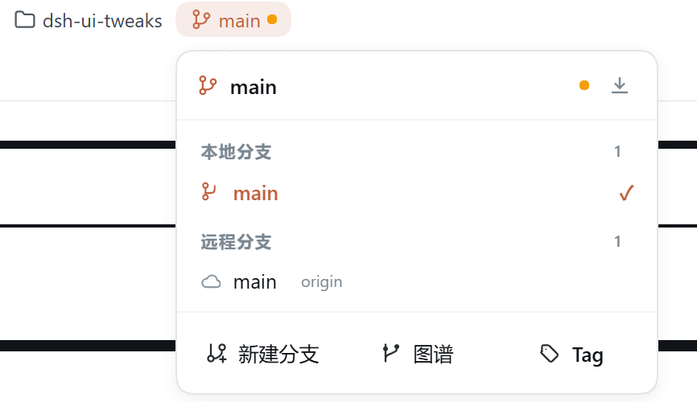

# dsh-ui-tweaks

[DeepSeek Harness](https://deepseek-harness.github.io/deepseek-harness/)（DSH）Web UI 插件：在设置面板中实时调整对话界面——字体大小、表格样式、对话框宽度、可开关的对话时间线、输入框上方的 **GitBar**（git 状态胶囊：分支 / 差异 / 提交），以及可开关的**归档管理**（设置中的「归档」页面：查看、恢复或彻底删除已归档会话）。

## 预览

| | |
|---|---|
|  |  |
| **对话时间线**：右侧竖轨，悬停展开消息预览、点击跳转、随滚动高亮当前位置，自动避让右侧边栏 | **表格样式**：Claude Desktop 浅灰圆角卡片风格 |
|  |  |
| **对话框宽度**：消息列、输入框、统计栏同步变宽 | **设置面板**：字体大小 / 表格样式 / 对话框宽度 / 时间线 / Git 状态栏 |
|  | |
| **GitBar**：输入框上方的 git 状态胶囊（分支 / 差异 / 提交），支持分支切换、删除、推送到远程，差异面板与提交弹窗 | |

## 功能

- **消息字体大小（px）**：直接输入数字（10–32），作用于消息正文、标题、表格与代码。
- **表格样式**：可选 `默认` 或 **Claude Desktop** 风格（浅灰圆角单元格卡片、单元格间有间隙、无边框、单元格与行内代码同底色、表头不加粗）。
- **对话框宽度（px）**：直接输入数字（600–1600）；消息列、输入框、输入框下方的统计栏（轮数/步数/耗时/tok/s）**三者同步变宽**。
- **对话时间线（可开关，默认关闭）**：在消息区右侧显示细竖导航轨——每条用户消息一根指示线，悬停展开面板预览消息、随滚动高亮当前位置、点击平滑跳转到对应消息（自动加载更早历史）。**浅色/深色模式都正常显示**，且**始终贴在消息区右侧**：即使安装了右侧边栏（如 dsh-better-sidebar）并展开，时间线也会自动避让、不会与侧边栏重叠。会话中用户消息少于 2 条时自动隐藏。
- **GitBar（默认关闭，可在设置中开启）**：当会话的工作目录是一个 git 仓库时，在输入框上方显示三颗 DSH 原生风格的紧凑胶囊（与输入框同宽、随“对话框宽度”设置联动）：
  - **分支胶囊（左）**：当前分支名（有未提交改动时带橙色圆点）；点击**向上**弹出分支面板——本地 / 远程分支列表（点击即 `git switch`），底部可**新建分支**（`git switch -c` 并自动切换）。
  - **差异胶囊（右）**：`+N −M · K 个文件`；点击从右侧滑出**差异面板**：文件列表 + 逐文件 diff（默认**只显示有差异的 hunk**，右上可切“完整文件”视图）。面板**支持拖动拉伸宽度**，展开时**自动把对话区往左挤**（不影响右侧时间线），底部可直接**提交 / 提交并推送**。面板内三段（文件列表 / diff 内容 / 提交区）之间的分隔线**可上下拖动调整高度**（双击复位；提交说明框随提交区高度拉伸，可写多行，Shift+Enter 换行）。
  - **commit message 胶囊（右）**：点击弹出提交对话框——输入说明（**留空点提交会自动生成**，LLM 优先、失败回退启发式规则）、待提交文件清单（只显示文件与 ±行数，**点击文件即打开差异面板定位到该文件**），按钮：取消 / ✨ 生成 / 提交 / 提交并推送（新分支自动 `-u` 设上游）。
  - 非 git 仓库或无会话 cwd 时整行自动隐藏；所有操作走服务端 `execFile('git', …)`（无 shell、带超时）。
- **归档管理（可开关，默认关闭）**：设置面板中的「归档」页面，列出所有已归档会话（标题 / 所在工作区 / 相对时间），支持**恢复**与**彻底删除**：
  - **恢复**：把会话移出归档——日志与工作区槽位原样保留，会话回到侧边栏列表。
  - **删除**：**彻底删除**该会话——服务端将其 JSONL 日志从磁盘移除、从工作区记账与归档集合中清除、并清理投影缓存，会话永久消失（不可恢复）。只有**正在运行**（有任务在跑）的会话会被拒绝；已打开但空闲的会话也会从内存中移除，删除后实时从列表消失。
  - 顶部另有**全部恢复 / 全部删除**批量操作（删除类操作需二次确认）。列表随 `host/archived-sessions-changed` 事件与客户端会话列表刷新实时更新，无需刷新页面。

所有修改**即时生效**，无需刷新。同一份配置也可以直接在设置文档里手改：

```yaml
ui-tweaks:
  fontSize: 16
  tableStyle: claude
  dialogWidth: 880
  timelineEnabled: true   # 默认 false（关闭），设为 true 开启
  gitBarEnabled: true     # 默认 false（关闭），设为 true 开启 GitBar
  archiveManagerEnabled: true   # 默认 false（关闭），设为 true 开启「归档」页面
  # suggestModel: 'provider:model'   # 可选：指定生成提交说明的模型
```

设置入口：**设置 → 界面调整**。

## 安装

```bash
# 方式一：从 npm 安装（推荐，预构建产物，一条命令装好）
npx -y @deepseek-ai/dsh plugin --profile web add dsh-ui-tweaks

# 方式二：从 GitHub 仓库安装（源码，会运行自包含的 prepare 构建）
npx -y @deepseek-ai/dsh plugin --profile web add github:wlj521/dsh-ui-tweaks
```

从 GitHub 安装时，pnpm 可能要求批准该包的构建脚本——把提示的包键加进该 profile 的 `pnpm-workspace.yaml`：

```yaml
allowBuilds:
  dsh-ui-tweaks: true
```

然后重新执行 `add`。安装完成后**重启一次 `dsh web`**（bundle 插件在进程启动时扫描）。

> 若 pnpm 报符号链接/hoist 相关错误，可在 profile 的 `pnpm-workspace.yaml` 中设置 `nodeLinker: hoisted`。

## 开发

```bash
pnpm install
pnpm build          # tsc（服务端）+ tsc（客户端）+ 打包 lib/client.js
pnpm typecheck
```

本地加载（覆盖层）或作为 bundle 安装：

```bash
npx -y @deepseek-ai/dsh web --patch ./cordis.patch.yml   # 开发覆盖层
npx -y @deepseek-ai/dsh plugin --profile web add .        # 从本目录作为 bundle 安装
```

## 工作原理

- **服务端**（`src/index.ts`）：注册 `ui-tweaks` 设置命名空间，并挂载同源路由 `/_dsh/ui-tweaks/settings`——rc.6 的 Web 设置 RPC 只暴露固定白名单命名空间，因此自定义路由是插件拥有配置页的方式。另在 `src/timeline.ts` 注册 `dshChatTimeline` 会话投影单元，持久化枚举用户消息。
- **Git 后端**（`src/git.ts` + `src/git-web.ts`）：通过 `ctx.get('sessions')`（可选服务）解析会话 header 的 `cwd` 作为“当前项目”，用 `child_process.execFile('git', …)`（无 shell、cwd 固定、超时 + 中止传播）执行只读/写操作；同源路由 `/_dsh/ui-tweaks/git/*` 提供 status / branches / diff（hunk 或完整文件，含绝对行号）/ suggest / commit / push / checkout / create。提交说明生成优先走 `ctx.get('llm')`（可选服务，收集 `text-delta` 流），不可用时回退到启发式规则（按文件类型推断 conventional commit 类型与 scope）。
- **浏览器端**（`src/client/index.tsx`）：读写该路由、渲染设置页，并通过运行时 `<style>` 元素实时应用样式，覆盖稳定的 DSH 锚点（`[data-chat-flow]`、`[data-composer-card]`、`body` 上的 markdown 字体 token、`[data-slot="conversation.chat.node"]` 内的 markdown 表格）。
- **时间线**（`src/client/timeline.tsx`）：挂在 `conversation.input.dock` 插槽、portal 到 `body`。数据按速度优先：会话投影 → 已加载聊天节点 → 后台 `loadOlder`。位置通过测量 `[data-conversation-scroll]`（消息区）右缘与垂直中线动态锚定，因此 DSH 原生列布局与右侧边栏（`#root` 的 margin-right 布局推挤）变化时都会自动跟随；颜色全部使用 DSH 主题变量（`--dsw-alias-*`），浅色/深色模式均正常。
- **GitBar**（`src/client/gitbar.tsx`）：挂在同一个 `conversation.input.dock` 插槽。胶囊行以 `width:100%` + `max-width` 与 composer 卡片同宽（buildRuntimeCss 在“对话框宽度”变化时同步覆盖该宽度，实现联动），胶囊行自身背景透明、只有胶囊可见；差异面板展开时通过 `#root { margin-right }` 把对话区往左挤，时间线 rail（锚定消息区右缘）因此不被遮挡。面板内的高度分配采用「只给被拖的那一段显式高度、diff 段 `flex:1` 吃掉余量」的方式，配合 45% 上限，拖动永远不会撑破面板。
- **归档管理**（服务端 `src/archive.ts` + 浏览器端 `src/client/archive.tsx`）：作为 `settings.section` 插槽（设置面板中的「归档」页面）。列表数据直接来自框架标准 hook `useSessions` + `useWorkspaces`（`archivedSessionIds`），无需额外查询；操作走同源路由 `/_dsh/ui-tweaks/archive`。**恢复**把会话 id 从工作区存储域的 `archivedSessionIds` 全局单例中移除（DSH 只暴露单向 `archiveSession`，无公开的取消归档 API，故直接写活体存储域句柄并同步工作区注册表的内存缓存）。**彻底删除**依次：拒绝正在运行的会话（`ctx.sessions.get` 非空即拒绝）→ 用持久化后端自身的 `findLog` 定位并 `rm` 会话日志目录 → 调用公开的 `WorkspaceEntity.detachSession` 摘除工作区记账 → 从归档集合移除并同步注册表内存缓存与 header 索引 → 尽力清理 `session_projcache` 投影缓存。写路径触发 `domain/changed` → 宿主推送 `host/archived-sessions-changed`，客户端随后 `sessions.refresh()` 重拉会话列表，行与会话本体实时消失。

## 协议

MIT
